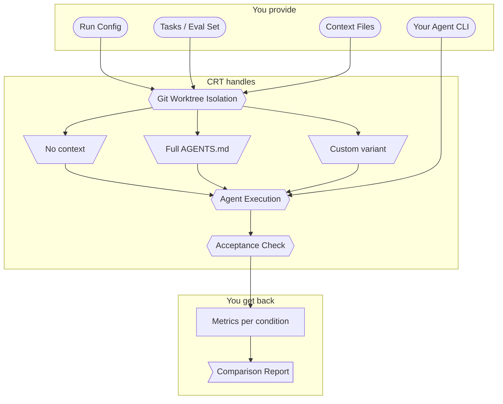

# context-reliability-testing

TDD for context files — measure whether your AGENTS.md, CLAUDE.md, and .cursorrules actually help on your repo.

## What it does

Runs the same coding tasks under different context conditions (no context vs. full AGENTS.md vs. custom variants) and compares pass rate, token usage, wall time, and tool calls.

## How it helps

Same task, same agent, only context differs. That isolates context as the variable so you can see what actually moves the needle vs. what's noise.

References: [Gloaguen et al.](https://arxiv.org/abs/2602.11988), [Zhang et al.](https://arxiv.org/abs/2604.11088), [Lulla et al.](https://arxiv.org/abs/2601.20404), [Sharma](https://arxiv.org/abs/2603.00822).

## How it works



## Quick start

```bash
uv sync --extra dev

# Scaffold configs from your repo (detects AGENTS.md, .cursorrules, etc.)
uv run crt init . --test-cmd "pytest -x"

# Dry run (show work scope, no agents invoked)
uv run crt run --config crt-config.yaml --tasks crt-tasks.yaml --dry-run

# Real run (agent output streams to terminal)
uv run crt run --config crt-config.yaml --tasks crt-tasks.yaml

# Compare two runs for regressions
uv run crt compare --baseline out/baseline.json --current out/results.json
```

## Commands

| Command | Description |
|---------|-------------|
| `crt init` | Scaffold starter configs by detecting context files in a repo |
| `crt run` | Run tasks under different context conditions and measure results |
| `crt compare` | Compare two result files and report regressions |

See **[USAGE.md](USAGE.md)** for agent setup, configuration reference, and detailed workflows.
